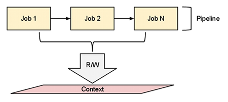

.. _architecture:

Architecture
===============================================================================

The MToolkit is a modular and simple software, it can be extended easily to
support :ref:`new risk calculations <contribute>`, this brief chapter explains
the key ideas behind his architecture.

A pipeline approach
-------------------------------------------------------------------------------

MToolkit's computation is organized in pipelines. The sequence of jobs inside
a pipeline reads and writes data to the context object. A job object acts
mainly as a wrapper to scientific risk functions. An intermediate job inside
the pipeline can use the output produced by previous jobs, by reading data
in the context object and can write the results of his computation in the
context.

Two phases strategy
-------------------------------------------------------------------------------

.. image:: ../img/MToolkitSetupPhase.png

.. image:: ../img/MToolkitExecutionPhase.png

MToolkit's computation can be seen as a two phases strategy. In the first one
the configuration file is read and two pipelines are built by a PipeLineBuilder
object. The preprocessing pipeline is a sequence of jobs which apply some
transformations to the earthquake catalogue (clean up), while the processing
pipeline can be seen as a mean to derive new data. The preprocessing and
processing pipelines are used by a Workflow object which is responsible about
their *activation*. In the second phase the workflow object activates the
preprocessing pipeline and the processing one according to an earthquake
catalogue filtering strategy. The processing pipeline is ran for every source
model, every processing pipeline is indipendent and produces new data which
enrich the original set of source models.
